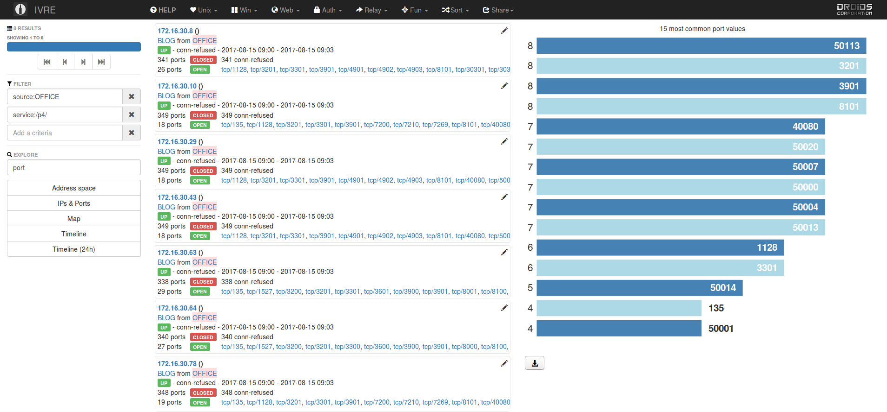

SAP Services detection via nmap probes
--------------------------------------

- [SAP Services detection via nmap probes](#sap-services-detection-via-nmap-probes)
- [How nmap can help us](#how-nmap-can-help-us)
- [SAP existing support in nmap](#sap-existing-support-in-nmap)
  * [Version and service detection](#version-and-service-detection)
- [How to generate and test probes](#how-to-generate-and-test-probes)
- [How to handle scan port range](#how-to-handle-scan-port-range)
  * [Port generation tool](#port-generation-tool)
  * [What about port customization by the admin?](#what-about-port-customization-by-the-admin)
- [How a scan looks like with custom SAP probes](#how-a-scan-looks-like-with-custom-sap-probes)
- [Issues encountered: SSL](#issues-encountered-ssl)
- [What can be improved](#what-can-be-improved)
- [What to do next with that information?](#what-to-do-next-with-that-information)
- [Conclusion](#conclusion)
- [Authors](#authors)

This article aims at showing how to improve the capability of the nmap
network scanner to detect SAP services. This is by no mean a complete
and 100% exact way of doing service detection as a lot of corner cases
exist that are not covered in this text. If you want a more
comprehensive way to do SAP services detection and even much more, the
[ERPScan Monitoring Suite](https://erpscan.com/products/erpscan-security-monitoring-suite-for-sap/)
is a good starting point with its port scanner feature.


## How nmap can help us

Our goal is to detect every network service exposed by SAP servers.
Those servers are complex beasts with numerous components exposed to
the network by default and each of these components potentially has
vulnerabilities. So we want to send specific network probes to detect
the presence of these services and then better assess if a service is
vulnerable or not.

Nmap is an open source network port scanner that can do many things
and especially service detection via fingerprints. We will explain how
one could implement a SAP-aware port scanner with this tool.

## SAP existing support in nmap

First, if you look closely at the official nmap release you will
notice that there are some traces of SAP support. It is actually very
sparse and can be confirmed by scanning a real SAP server:

```
Nmap scan report for 172.16.30.29
Host is up (0.00018s latency).
Not shown: 65508 closed ports
PORT      STATE SERVICE         VERSION
1128/tcp  open  soap            gSOAP 2.7
3201/tcp  open  cpq-tasksmart?
3299/tcp  open  saprouter?
3301/tcp  open  unknown
3901/tcp  open  nimsh?
4901/tcp  open  sybase-adaptive Sybase Adaptive Server
4902/tcp  open  sybase-backup   Sybase Backup Server
4903/tcp  open  unknown
8101/tcp  open  http            SAP Message Server httpd release 745
30101/tcp open  unknown
30102/tcp open  unknown
30103/tcp open  unknown
30104/tcp open  unknown
30107/tcp open  unknown
30108/tcp open  unknown
30111/tcp open  http            BaseHTTPServer 0.3 (Python 2.7.10)
30116/tcp open  unknown
40000/tcp open  safetynetp?
40001/tcp open  unknown
40002/tcp open  unknown
40080/tcp open  http            SAP Internet Graphics Server httpd
46287/tcp open  status          1 (RPC #100024)
50000/tcp open  http            SAP WebDispatcher
50001/tcp open  ssl/http        SAP WebDispatcher
50004/tcp open  unknown
50007/tcp open  unknown
50013/tcp open  soap            gSOAP 2.7
50014/tcp open  ssl/soap        gSOAP 2.7
50020/tcp open  unknown
50113/tcp open  soap            gSOAP 2.7
50114/tcp open  ssl/soap        gSOAP 2.7
```

The columns SERVICE and VERSION shows us plenty of unknown or
improperly named fields. This situation can be improved if we analyze
each unknown port/protocol.

If you dig a bit more you'll find that Core Security researcher Martin
Gallo wrote much more improved support for SAP proprietary protocol
(available at
[corelabs-nmap-service-probes.txt](https://www.coresecurity.com/system/files/publications/2016/05/corelabs-nmap-service-probes.txt))
that does smarter stuff like extracting technical server information
from answers. That is a very good starting point and as we included
some of these probes we enlarged the support a bit more.

### Version and service detection

Nmap key file for service detection is `nmap-service-probes` (stored
in `/usr/share/nmap/` for Linux installation).

The format is quite self-explanatory for its main features. Let us
consider one of the simplest example:

```
Probe TCP NULL q||
match sajpoin m|SAP_Cluster_Manager| p/SAP Java Cluster Join Service/
```

The `Probe` line describes the TCP payload that we send to the server.
In this case, we connect to the TCP port without sending any TCP
payload after the 3-way handshake.

The next line beginning with `match` describes what we want to check
from the server's answer. A match is final, the parser won't check
another match for the given probe (as long as we don't use
`softmatch`). In this example, we look for the ASCII string
`SAP_Clutser_Manager` via a regular expression. If the expression is
matched, then nmap tags the matching port with the product name "SAP
Java Cluster Join Service".

That probe can be used many times for all those protocols that are
based on the first message sent by the server to the client (SSH, FTP,
mail protocols, for example). We just add other `match` lines after
the `Probe`.

Full documentation of this file format can be found at
[https://nmap.org/book/vscan-fileformat.html](https://nmap.org/book/vscan-fileformat.html)


## How to generate and test probes

So now, we need a way to know which packets need to be sent and what
specific piece of information inside an answer can allow us to
identify with a good assurance what protocol is being used and from
that determine what is the service using this protocol. In order to
illustrate the difference about service and protocol, you can look at
the HTTP protocol and all the different services that will make use of
it.

SAP services implement many different binary protocols that does not
ease our task.

Let's have a look at a simple probe for a service using a binary
protocol: SAP Router.

```
Probe TCP SAProuter q|\x00\x00\x00\x00|
ports 3299
match saprouter m|SAProuter ([\d.]+) on '(\w+)'| p/SAProuter/ v/$1/ h/$2/
match saprouter m|SAProuter| p/SAProuter/
```

Per official documentation SAP router service should be listening to
the port tcp/3299.

When sending the binary request `\x00\x00\x00\x00` to a SAP Router we
can get several answers depending on the router version/configuration.

Sometime the SAP Router can leak information like version + hostname,
so we try to match this specific answer first and then we try to match
the more generic answer without the information disclosure.

The additional information we gather in the first `match` can be
propagated and printed nicely by nmap using the version field and the
hostname. That is what we accomplish with help of regular expression
groups (using parenthesis inside the expression) and by referencing
them via their position in the `v//` and `h//` statement ('v' standing
for version, and 'h' for hostname).

## How to handle scan port range

Usually with nmap, if we do not specify -p option it will scan the
1000 most used port (from Internet statistics). Unfortunately, many
SAP ports will be missed by doing so. Therefore, we need to scan all
65535 ports at a big scan time cost or we look a bit closer at how to
generate these SAP ports. For efficiency, we decide to choose the
second option.

If we look at SAP documentation, we see their rules to define
potential ports for each services. So by using these rules, we can
expand the full list of potential SAP ports.

SAP services have the notion of instance number, this is a number that
can vary from 00 to 99 and the port of the service will depend on it.

SAP official documentation on all SAP TCP ports used by their services
can be accessed at
[https://cp.hana.ondemand.com/dps/d/preview/47673f06bd494db680ff6150c0b08108/2.0/en-US/frameset.htm](https://cp.hana.ondemand.com/dps/d/preview/47673f06bd494db680ff6150c0b08108/2.0/en-US/frameset.htm)


For example the web ports for ICM HTTP service are noted 80NN, with NN
being this instance number. It means they can cover the range
8000-8099.

If we look at another example the SAP TREX nameserver service will
listen on ports 3NN01. So our potential port range will be from 30001,
30101, 30201,...,39901.

You can find port collision with two (and more) different
services/protocols using theoretically the same port. Some examples:
32NN used on the Netweaver Java platform by the Enqueue service and on
the Netweaver ABAP platform by the Dispatcher service. Another one is
the previous example with port 3NN01 being used by SAP TREX nameserver
and SAP HANA TREXNet internal nameserver port.

Nmap handle all of that nicely with its service detection algorithm
given a proper `nmap-service-probe` file: we can have the same port
used in a `Probe` rule, and several `match` on a single port.

### Port generation tool

The following python tool [sap_ports.py](sap_ports.py) takes care of
port generation and prints out a comma-separated list of ports that
can be used as the nmap `-p` parameter as following:

```
$ nmap -p $(sap_ports.py) $TARGETS
```

The main idea of `sap_ports.py` is to use a statically defined
dictionary with information gathered from SAP on-line documentation to
generate the list of ports with possibility to generate a subset of
the ports depending on several criteria.

### What about port customization by the admin?

During our security audit we saw rarely cases of port
customization. One example case lead to wrong assumption on the
instance number of a service by analyzing the port number. For
instance: using 3617 for the message server service on the instance
number 32... In this case it is necessary to inspect the protocol and
use information disclosures to be able to disambiguate this situation.

There is no generic answer to this problem if we do not want to scan
the 64k TCP ports. We accept in this article the low risk that some
port customization could be out of our static port range from our
experience of seeing it very rarely.

## How a scan looks like with custom SAP probes

```
Nmap scan report for 172.16.30.29
Host is up (0.00018s latency).
Not shown: 6563 closed ports
PORT      STATE SERVICE             VERSION
22/tcp    open  ssh                 OpenSSH 6.2 (protocol 2.0)
111/tcp   open  rpcbind             2-4 (RPC #100000)
1128/tcp  open  sapstartservice     SAP Management Console (SID SAP, NR 99)
3201/tcp  open  sapjavaenq          SAP Enqueue Server
3299/tcp  open  saprouter           SAProuter 40.4
3301/tcp  open  sapgateway          SAP Gateway
3901/tcp  open  sapms               SAP Message Server
4901/tcp  open  sapase              SAP ASE Database
4902/tcp  open  sybase-backup       Sybase Backup Server
4903/tcp  open  unknown
8101/tcp  open  sapmshttp           SAP Message Server httpd release 745 (SID J45)
30201/tcp open  saptrex             SAP TREX Name server
30202/tcp open  saptrex             SAP TREX Preprocessor
30203/tcp open  saptrex             SAP TREX Index server
30204/tcp open  saptrex             SAP TREX Queue server
30207/tcp open  saptrex             SAP TREX RFC server
30208/tcp open  saptrex             SAP TREX Cruise server
30211/tcp open  saptrex             SAP TREX AlertServer (BaseHTTP/0.3 Python/2.7.10)
30216/tcp open  saptrex             SAP TREX Index server
40080/tcp open  sapigs              SAP Internet Graphics Server
50000/tcp open  sapjavaweb          SAP NetWeaver Application Server (Kernel version 7.45, Java version 7.50)
50001/tcp open  ssl/sapjavaweb      SAP NetWeaver Application Server (Kernel version 7.45, Java version 7.50)
50004/tcp open  sapjavap4           SAP JAVA P4 (Potential internal IP 172.16.30.29)
50007/tcp open  sapp4iiop           (Internel IP 172.16.30.29)
50013/tcp open  sapstartservice     SAP Management Console (SID J45, NR 00)
50014/tcp open  ssl/sapstartservice SAP Management Console (SID J45, NR 00)
50020/tcp open  sapjoin             SAP Java Cluster Join Service
50113/tcp open  sapstartservice     SAP Management Console (SID J45, NR 01)
50114/tcp open  ssl/sapstartservice SAP Management Console (SID J45, NR 01)
50213/tcp open  sapstartservice     SAP Management Console (SID TRX, NR 02)
Service Info: Host: java745;
```

## Issues encountered: SSL

In theory there is the keyword `sslports` in the service-probe file
that may indicate on which port a specific probe should be checked
upon the SSL layer. In practice these specified ports were not
properly validated as SSL ones without ripping the whole probes
related to SSL in the original nmap-service-probe file (begins in our
custom probe file at the `Probe TCP SSLSessionReq`).

## What can be improved

Code exploits / port information disclosure in NSE Lua scripts tagged
by categories:
- version, discovery, exploit, auth, dos
- safe, intrusive

## What to do next with that information?

If you are a pentester, you probably have a bag full of exploits for
specific SAP services, so you want to automatically link open ports to
exploits attempts. That can be easily done by storing the nmap scan into
an XML file (-oX option) and then writing a parser that will generate
exploit command-line to be executed on the specific open ports.

On the other hand, if you are a security analyst or doing operational
security you probably want to store those results and be able
afterwards to search them to detect change in the landscape or be able
to pinpoint vulnerable services by their version. For this mean, we
use the [IVRE framework](https://ivre.rocks/) that can import our XML
nmap scans and provides a nice web interface to query scan results and
allows doing basic statistics/reporting tasks.

The attached screenshots shows a scan in IVRE with filtering OFFICE
(internal lab) scan source and looking for P4 service (present on Java
NetWeaver application servers) detected on the network. The right
column shows the top ports histogram computed from those specific scan
results.




## Conclusion

We hope that this will help you better understand what is hidden
behind those cryptic SAP servers and show you that only with network
level probes we can go deep in this knowledge of what is behind an SAP
server.

This blog post is a way to remind that SAP servers have a huge
exposition surface and that enforcing a strict networking policy
including them is part of a good security hygiene.

This article and the associated Nmap files are available at
[github.com](https://github.com/gelim/nmap-erpscan). A web-only
version is available at
https://erpscan.com/press-center/blog/sap-services-detection-via-nmap-probes/


## Authors
 
 Name | Mail  | Involvement
------|-------|------------
Mathieu Geli | <m.geli@erpscan.com>  | Main author/maintainer of those files
Michael Medvedev | <m.medvedev@erpscan.com> | Second author
Martin Gallo | <mgallo@coresecurity.com>  | Initial support on Diag/RFC/MS/Enqueue protocols
Joris van de Vis | <jvdvis@erp-sec.com>  | Improvements over RFC probes
